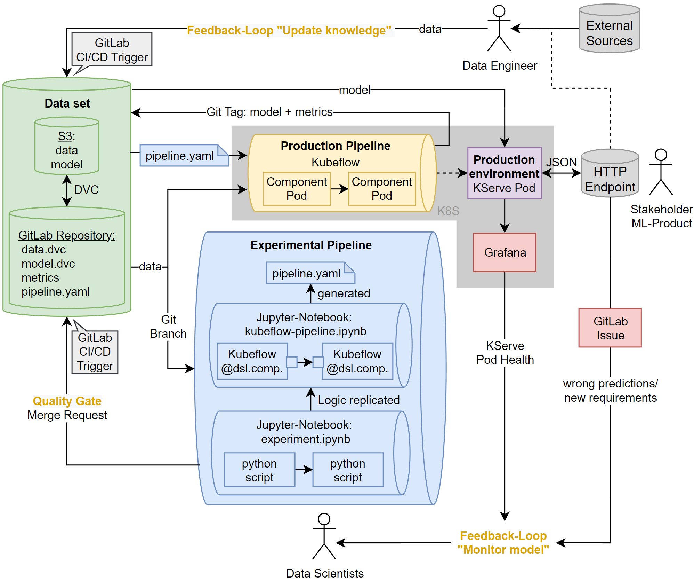

# What is MLOps?

Most development projects for machine learning products fail to embed pipelines for creating machine learning models in a business context. Thus the majority of ML models fail to reach the production environment and deliver no financial
value [1, 4]. 

On the one hand, a way of working with cross-team communication and validation must be ensured internally, on the other hand, data scientists need an isolated, experimental space to develop the ML model. The MLOps framework was created to solve this dilemma. [2, 3, 5]

- **Experimental Pipeline**: This DS pipeline enables data scientists to dynamically develop the ML model. Separated from the production environment, new DS pipeline stages and ML algorithms can be tested there. 

- **Production pipeline**: To create an ML product for the production environment, production pipeline runs through the steps of a replicated experimental pipeline.
pipeline. The resulting ML product is automatically used in the production environment. environment. This pipeline is triggered when a new experimental pipeline has been has been transferred and the data set has been updated with new data. 

- **Quality gate**: Before the changes to the experimental pipeline are transferred to the production pipeline, a request for validation must be submitted. 

- **Feedback loop** ***"Monitor model"***: The operation of the ML product in the production environment is continuously monitored by the data scientists,
for example, hardware resources and feedback from the ML product's stakeholders.

- **Feedback loop** ***"Update knowledge"***: Updating the data requires MLOps
as a process to be implemented by the users. It is used for both
both the experimental and production pipelines are always based on a current data set.
data set in both the experimental and production pipelines.

  

<b>Sources</b>

[1] Gartner: Gartner survey reveals less than half of data and analytics teams effectively provide value to the organization. (2023) 
[2] Mäkinen et al.: Who needs mlops: What data scientists seek to accomplish and how can mlops help? (2021) 
[3] Shankar et al.: Operationalizing machine learning: An interview study. (2022) 
[4] Staff, V.: Why do 87% of data science projects never make it into production?
(2019) 
[5] Subramanya, R., Sierla, S., Vyatkin, V.: From devops to mlops: Overview and application to electricity market forecasting (2022)

## About this Project

The project showcases the implementation of MLOps by utilizing Kubeflow as a pipeline execution system on Kubernetes. Specifically, it focuses on the "Inference-as-a-Service" use case, where a regression model is deployed on an HTTP server. This server accepts inputs in a JSON body and returns predictions for fuel consumption based on the provided inputs. 

**Note:** This project was mirrored from my private GitLab repository where I hosted the application.

## Installation

**Disclaimer:** Please note that this setup is intricate and customized to individual needs. Variations in Kubernetes applications may lead to trial and error, particularly depending on your Kubernetes version and cloud provider. The provided instructions offer a basic framework for establishing an MLOps setup. For a comprehensive understanding and theoretical background, refer to the [accompanying paper](.documentation/paper_german.pdf), written in German. Feel free to contact me for any further questions.

### Prerequisites
- Remote Git Repository with CI/CD Pipeline functionality - Tested with GitLab.
- Remote Data Store compatible with Data Version Control (DVC) - Tested with Amazon S3.
- Kubernetes Cluster with Kubeflow and KServe operational. ServiceAccount, RoleBindings and an Ingress in given in the [`kubernetes/`](kubernetes/) folder. Please refer to the official documentations.

### 1. Experiment locally: [`experimental-pipeline.ipynb`](pipelines/experimental-pipeline.ipynb)
- Start by working on your model locally, as you would in a typical ML pipeline: Input your datase, output a trained model.
- The steps given in `.documentation/experimental-pipeline.ipynb` train a model on the auto-mpg dataset and export it in as `.pkl`.

### 2. Upload data to remote storage using DVC
- Upload your data to remote storage using DVC. Refer to the official data version control documentation for guidance. This results in a `.dvc` file for your data.
- Check out the provided DVC configuration in the `data.csv.dvc` file and the `.dvc/` folder.

### 3. Mapping to Kubeflow syntax: [`production-pipeline.ipynb`](pipelines/production-pipeline.ipynb)
The objective of this step is to create the "production" Pipeline, which executes on Kubeflow within the Kubernetes cluster. Besides training the model, this pipeline must encompass the following tasks as done in `.documentation/production-pipeline.ipynb`:
1. Cloning the Git Repository to detect any new data or model changes indicated by alterations in the `.dvc` files.
2. Uploading the newly trained model to remote storage using DVC, including committing the `.dvc` files to the Git repository.
3. Configuring a KServe task linked to the remote storage for automatic deployment of new models.

As the last step, export this Kubeflow pipeline as a YAML file like given in `.documentation/production-pipeline.yaml` 

### 4. CI/CD Pipeline: [`.gitlab-ci.yml`](pipelines/.gitlab-ci.yml)
- Write a CI/CD Pipeline YAML file to automatically invoke the Kubeflow API with the current production pipeline.
- When implementing a merge (or pull) request-based workflow, exclusively cross-validated pipelines and models will be deployed.

### 5. Create an [Inference-as-a-Service client](inference-as-a-service-client) (optionally)
- In this implementation, a simple static HTML page can be hosted on an NGINX server which calls the HTTP endpoint of KServe for given car data and displays the prediction.